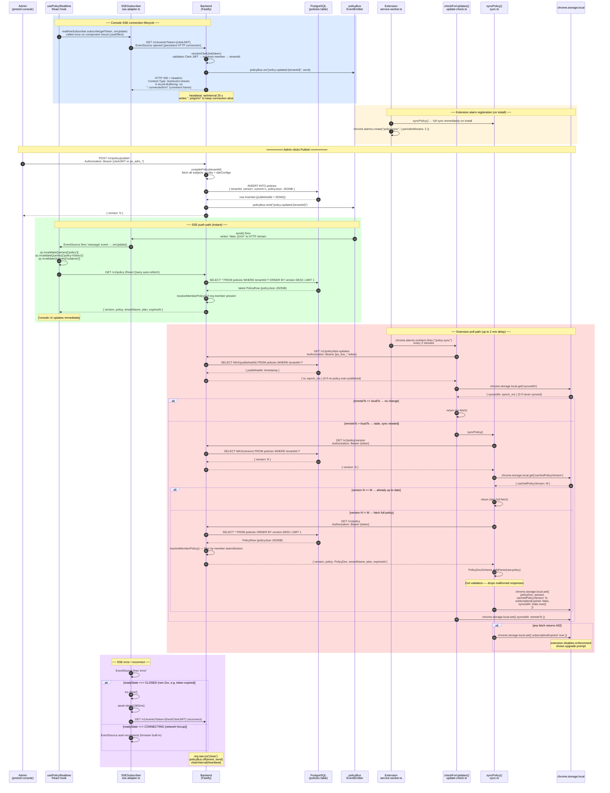
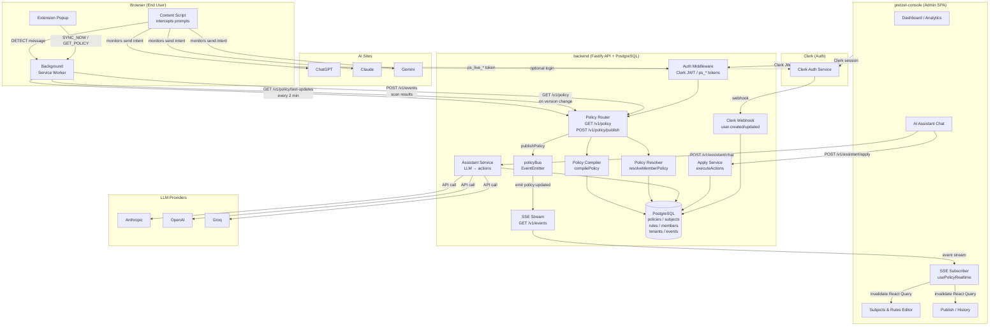
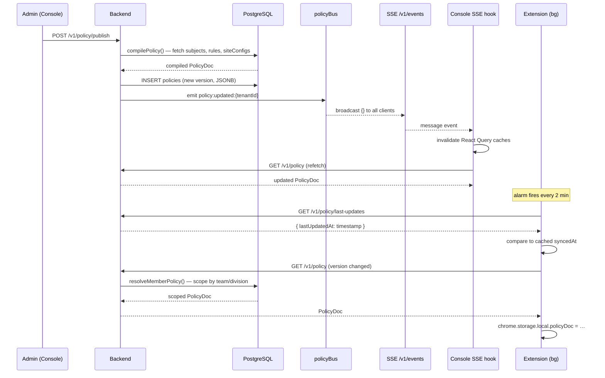
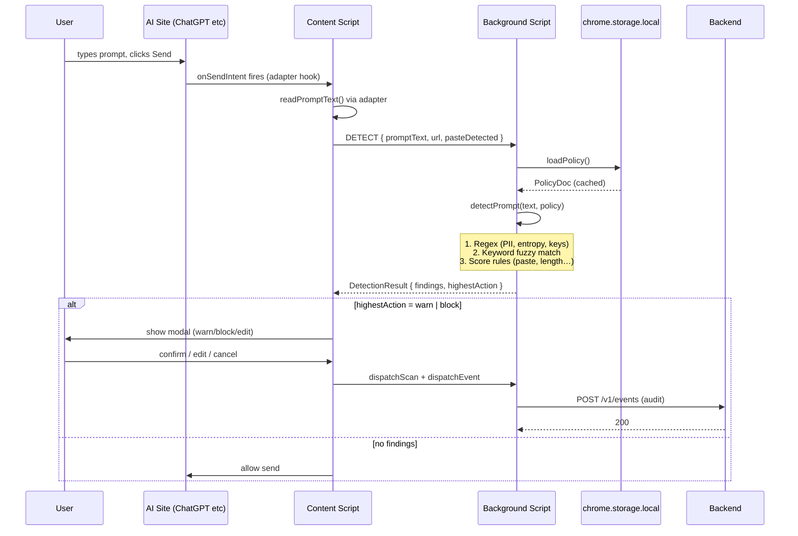
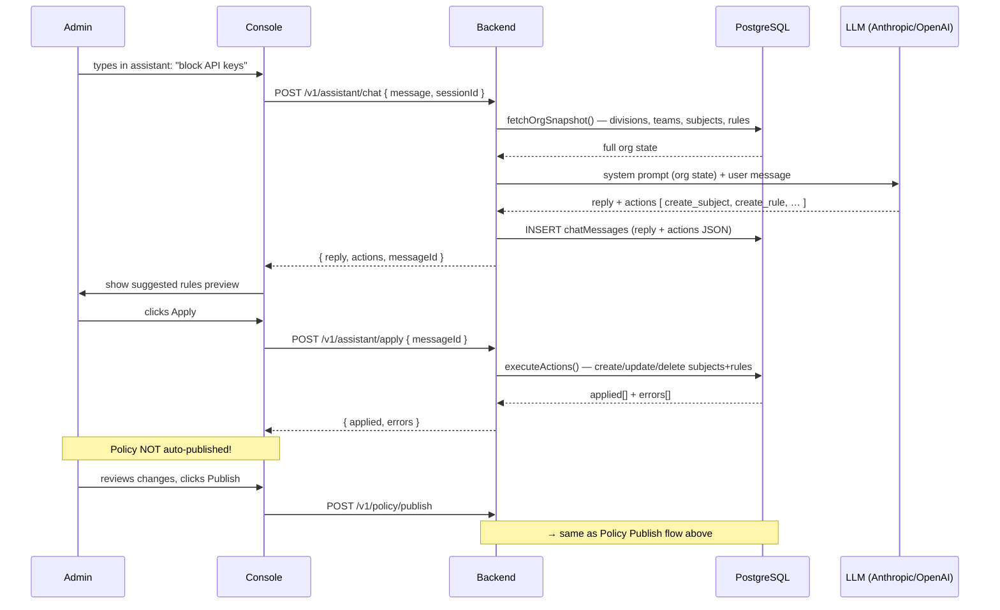
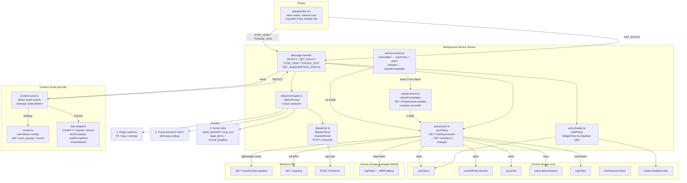

# mykka.ai — System Architecture

## 0. Real-Time & Polling Update Flow (Detailed)

Two parallel paths — **Console** (SSE, instant) and **Extension** (poll every 2 min):



### Key constants from code

| Value | Source | Where |
|---|---|---|
| Alarm period | `periodInMinutes: 2` | [service-worker.ts:27](pretzel/src/background/service-worker.ts#L27) |
| SSE heartbeat | `setInterval(25_000)` | [router.ts:81](backend/src/policy/router.ts#L81) |
| Reconnect delay | `setTimeout(1000)` | [sse.adapter.ts:21](pretzel-console/src/realtime/sse.adapter.ts#L21) |
| policyBus max listeners | `setMaxListeners(1000)` | [policy-bus.ts:4](backend/src/events/policy-bus.ts#L4) |
| SSE event key | `policy:updated:{tenantId}` | [policy-bus.ts:7](backend/src/events/policy-bus.ts#L7) |
| last-updates DB query | `MAX(policies.publishedAt)` | [router.ts:52](backend/src/policy/router.ts#L52) |
| Full sync guard | `cachedPolicyVersion === contentVersion` → skip | [sync.ts:25](pretzel/src/policy/sync.ts#L25) |
| Invalidated queries | `['policy']`, `['policy-history']`, `['subjects']` | [usePolicyRealtime.ts:14](pretzel-console/src/hooks/usePolicyRealtime.ts#L14) |


## 1. High-Level System Overview



---

## 2. Policy Publish Flow



---

## 3. Prompt Detection Flow



---

## 4. AI-Assisted Rule Creation Flow



---

## 5. Backend Internals

```mermaid
graph TD
    subgraph Routes["API Routes (/v1/*)"]
        R_POL[policy/router.ts<br/>GET /policy<br/>GET /policy/version<br/>GET /policy/last-updates<br/>POST /policy/publish<br/>GET /policy/history<br/>POST /policy/rollback/:v<br/>GET /events SSE]
        R_SUBJ[subjects/router.ts<br/>CRUD subjects + rules]
        R_MEMBERS[members / teams /<br/>divisions / invites]
        R_ASST[assistant/router.ts<br/>POST /chat, /apply]
        R_ANALY[analytics + audit-log]
        R_SITE[site-configs/router.ts]
        R_BILL[billing/router.ts]
    end

    subgraph AuthLayer["Auth Middleware"]
        AM_ORG[requireOrgTokenOrClerkAuth<br/>ps_live_* OR Clerk JWT]
        AM_ADM[requireAdminTokenOrClerkAdmin<br/>ps_adm_* OR Clerk super_admin]
        AM_SUB[requireActiveSubscription<br/>blocks if expired]
        TOK[tokens.ts<br/>parse + bcrypt compare]
        CLERK_V[resolveClerkJwt<br/>clerkId → user → member]
    end

    subgraph PolicyEngine["Policy Engine"]
        COMP[compiler.ts<br/>compilePolicy<br/>subjects+rules+siteConfigs → PolicyDoc]
        RES[resolver.ts<br/>resolveMemberPolicy<br/>filter by team/division scope<br/>dedup rules, expand destGroups]
        PUB[publishPolicy<br/>INSERT + emit policyBus]
        BUS2[policyBus<br/>EventEmitter<br/>policy:updated:{tenantId}]
    end

    subgraph AssistantEngine["Assistant Engine"]
        CHAT[service.ts<br/>buildSystemPrompt<br/>call LLM<br/>store messages]
        APPL[apply.ts<br/>executeActions<br/>batch create/update/delete]
        SVR[subject-versions.ts<br/>snapshot for rollback]
    end

    subgraph DBSchema["PostgreSQL Schema (Drizzle)"]
        T_TEN[tenants<br/>subscription, tokens]
        T_USR[users + members<br/>roles: super_admin<br/>division_admin, member]
        T_SUBJ[subjects<br/>scope: global/division/team]
        T_RULES[rules<br/>kind: keyword/pattern/entropy/score<br/>action: warn/block]
        T_POL[policies<br/>version, JSONB snapshot]
        T_DEST[destinationGroups<br/>domain arrays]
        T_SITE[siteConfigs<br/>CSS selectors per AI site]
        T_SESS[chatSessions + chatMessages<br/>LLM conversation history]
        T_AUDIT[events + scans<br/>analytics]
        T_VERS[subjectVersions<br/>rollback snapshots]
    end

    R_POL --> AM_ORG --> PolicyEngine
    R_POL --> AM_ADM --> PolicyEngine
    R_SUBJ --> AM_ADM --> DBSchema
    R_ASST --> AM_ADM --> AssistantEngine
    R_MEMBERS --> AM_ADM --> DBSchema
    AM_ORG --> TOK & CLERK_V
    AM_ADM --> TOK & CLERK_V
    AM_ORG --> AM_SUB

    COMP --> T_SUBJ & T_RULES & T_SITE & T_DEST
    RES --> T_SUBJ & T_RULES & T_DEST
    PUB --> T_POL
    PUB --> BUS2

    CHAT --> T_SESS
    APPL --> T_SUBJ & T_RULES
    APPL --> SVR --> T_VERS
```

---

## 6. Extension Internals



---

## 7. Admin Console Internals

```mermaid
graph TD
    subgraph Pages["Pages (Next.js App Router)"]
        P_DASH[/ — Dashboard<br/>analytics summary]
        P_SUBJ[/subjects — Rules Editor<br/>create/edit/delete<br/>subjects + rules]
        P_MEM[/members — Team<br/>invite, roles]
        P_AUDIT[/audit — Event Log<br/>rule triggers, actions]
        P_SET[/settings — Org<br/>token rotation, name]
        P_ASST[/assistant — AI Chat<br/>suggest + apply rules]
        P_PUB[/publish — Policy<br/>preview, history, rollback]
    end

    subgraph Realtime["Real-Time (SSE)"]
        SSE_AD[sse.adapter.ts<br/>SSESubscriber<br/>connect /v1/events<br/>auto-reconnect 1s]
        RT_HOOK[usePolicyRealtime.ts<br/>subscribe on mount<br/>pass Clerk getToken]
        INVAL[invalidate queries<br/>policy + policy-history<br/>+ subjects]
    end

    subgraph Hooks["React Query Hooks"]
        H_SUBJ[useSubjects<br/>useRules]
        H_ORG[useDivisions<br/>useTeams<br/>useMembers]
        H_POL[usePolicy<br/>usePolicyHistory]
        H_ASST[useAssistant<br/>useAssistantSessions]
        H_ANALY[useAnalytics<br/>useAuditLog]
    end

    subgraph API["API Client (api.ts)"]
        REQ[request helper<br/>inject Bearer token<br/>Clerk JWT / local storage]
        ENDPOINTS[subjects / rules<br/>policy / publish / rollback<br/>assistant / apply<br/>analytics / audit-log<br/>members / invites<br/>tenant / billing]
    end

    subgraph Auth["Auth (Clerk)"]
        CL_HOOK[useAuth / useUser<br/>Clerk React hooks]
        CL_TOK[getToken()<br/>Clerk session JWT]
        REQ_AUTH[RequireAuth.tsx<br/>redirect if not authed]
    end

    Pages --> Hooks
    P_SUBJ --> H_SUBJ
    P_DASH --> H_ANALY
    P_MEM --> H_ORG
    P_PUB --> H_POL
    P_ASST --> H_ASST

    Hooks --> API
    API --> REQ
    REQ --> CL_TOK

    RT_HOOK --> SSE_AD
    SSE_AD -->|message event| INVAL
    INVAL --> H_POL & H_SUBJ

    CL_HOOK --> CL_TOK
    REQ_AUTH --> CL_HOOK

    REQ -->|GET POST PATCH DELETE| BACKEND[(Backend /v1/*)]
```

---

## 8. Auth & Token Flow

```mermaid
graph LR
    subgraph Tokens["Token Types"]
        ORG[ps_live_{slug}_{secret}<br/>Org token — extension use]
        ADM[ps_adm_{slug}_{secret}<br/>Admin token — console use]
        CLERK_J[Clerk JWT<br/>console + optional extension]
    end

    subgraph Validation["Backend Validation"]
        PARSE[parse token prefix<br/>ps_live / ps_adm / Bearer]
        HASH[bcrypt.compare<br/>secret vs stored hash]
        CLERK_V2[resolveClerkJwt<br/>clerkId → users → members]
        SUB_CHK[requireActiveSubscription<br/>401 if expired grace]
    end

    subgraph Storage["Where Tokens Live"]
        MDM[chrome.storage.managed<br/>MDM enterprise deploy]
        LOC_EXT[chrome.storage.local<br/>manual entry]
        LOCAL_S[localStorage<br/>console auth]
        CLERK_S[Clerk session store]
    end

    ORG -->|in Authorization header| PARSE
    ADM -->|in Authorization header| PARSE
    CLERK_J -->|Bearer in Authorization| PARSE
    PARSE --> HASH
    PARSE --> CLERK_V2
    HASH --> SUB_CHK
    CLERK_V2 --> SUB_CHK

    MDM --> ORG
    LOC_EXT --> ORG
    LOCAL_S --> ADM
    CLERK_S --> CLERK_J
```

---

## Component Responsibility Summary

| Component | Role | Auth | Real-Time |
|---|---|---|---|
| **backend** | API, policy compilation, LLM orchestration, DB | Clerk JWT + `ps_*` tokens (bcrypt) | SSE broadcast via policyBus |
| **pretzel** (extension) | Prompt interception, local detection, scan logging | `ps_live_*` org token | 2-min poll `GET /policy/last-updates` |
| **pretzel-console** | Rule authoring, AI assistant, analytics, publish | Clerk JWT | SSE subscriber → React Query invalidation |

## Key Timing / Sync Facts

- Extension polls every **2 minutes** (chrome.alarms)
- Full policy sync only if `lastUpdatedAt > syncedAt` (version gate)
- Console gets updates **instantly** via SSE on publish
- AI-applied rule changes are **not auto-published** — admin must click Publish
- Subscription expiry: extension gets 402 → sets `subscriptionExpired` flag locally
